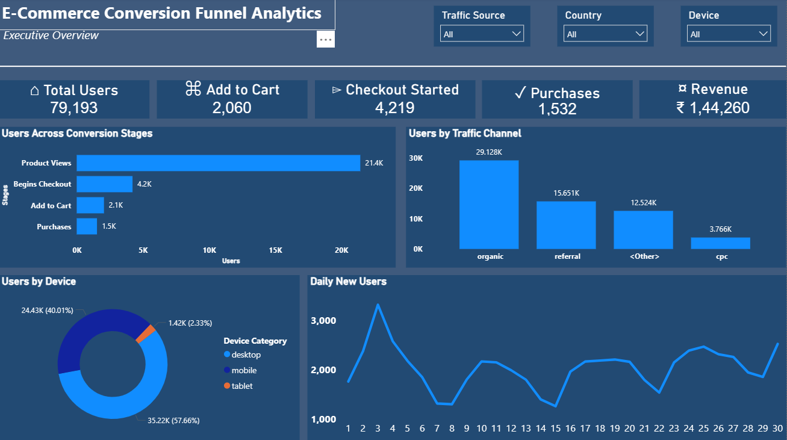
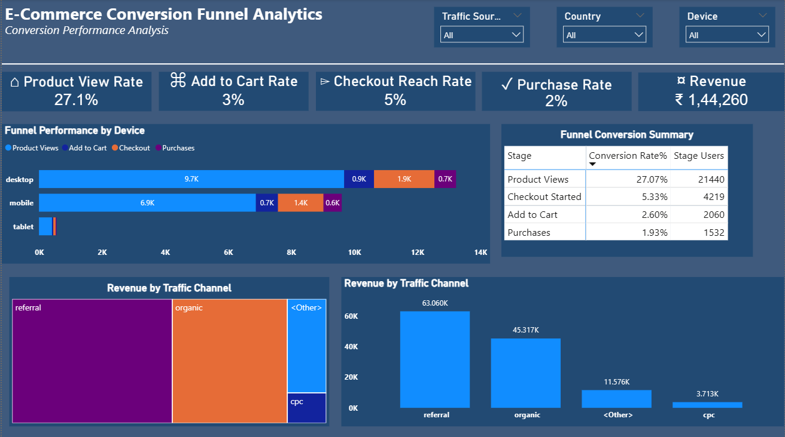

# Product-Journey-Conversion-Analytics
## 📌 Project Overview

This project analyzes the customer purchase journey using Google Analytics 4 (GA4) event data to identify conversion bottlenecks and revenue-driving acquisition channels. It tracks user behavior across key funnel stages, including product views, cart additions, checkout, and purchases.

An end-to-end analytics pipeline was built using **BigQuery**, **dbt**, and **Power BI** to transform raw event data into interactive dashboards that provide insights into conversion performance, traffic channels, device behavior, and revenue trends.

## 🏗️ Architecture

## 📊 Dashboard Preview

### Executive Overview 
Provides a high-level view of user activity, funnel performance, traffic channels, device distribution, and key business metrics.

### Conversion Performance Analysis
Focuses on conversion efficiency, revenue contribution, device-level funnel performance, and overall funnel progression to identify optimization opportunities.

## ✨ Project Highlights

-Built an end-to-end analytics pipeline using Google Analytics 4 (GA4), BigQuery, dbt, and Power BI.
-Designed a layered dbt data model to transform raw event data into analytics-ready fact tables for reporting.
-Developed two interactive Power BI dashboards to analyze user journeys, funnel performance, acquisition channels, device behavior, and revenue trends.
-Created SQL and DAX calculations to measure conversion rates, funnel progression, and key business KPIs for decision-making.

