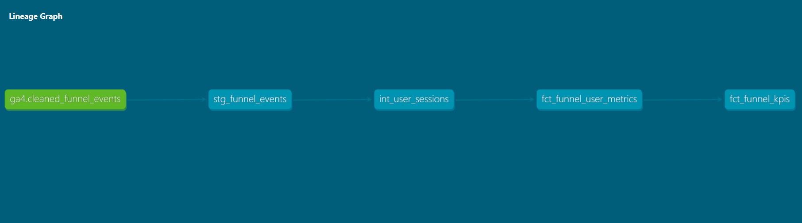

# Product-Journey-Conversion-Analytics
## 📌 Project Overview

This project analyzes the customer purchase journey using Google Analytics 4 (GA4) event data to identify conversion bottlenecks and revenue-driving acquisition channels. It tracks user behavior across key funnel stages, including product views, cart additions, checkout, and purchases.

An end-to-end analytics pipeline was built using **BigQuery**, **dbt**, and **Power BI** to transform raw event data into interactive dashboards that provide insights into conversion performance, traffic channels, device behavior, and revenue trends.

## 🏗️ Architecture

